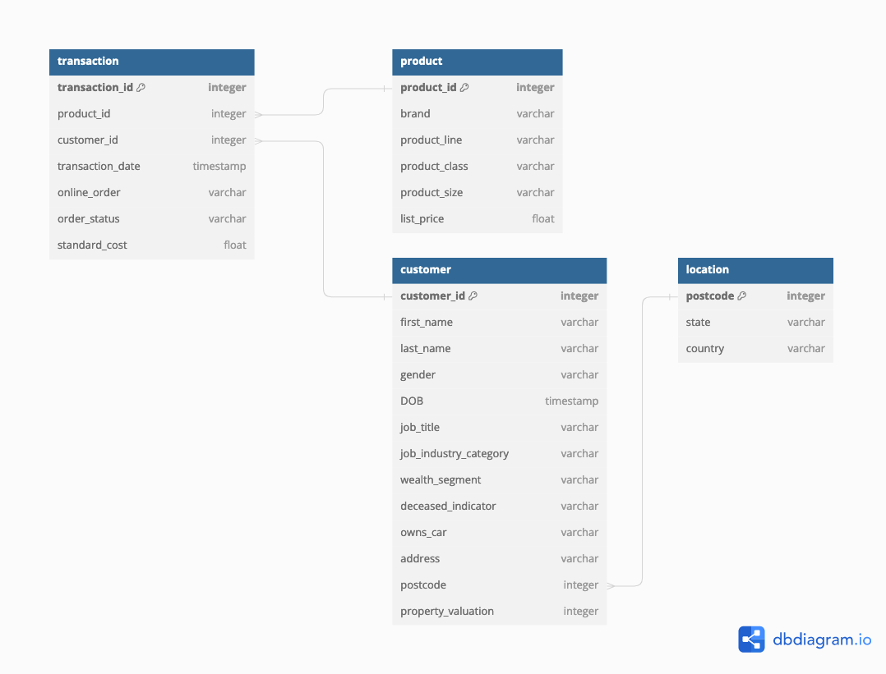
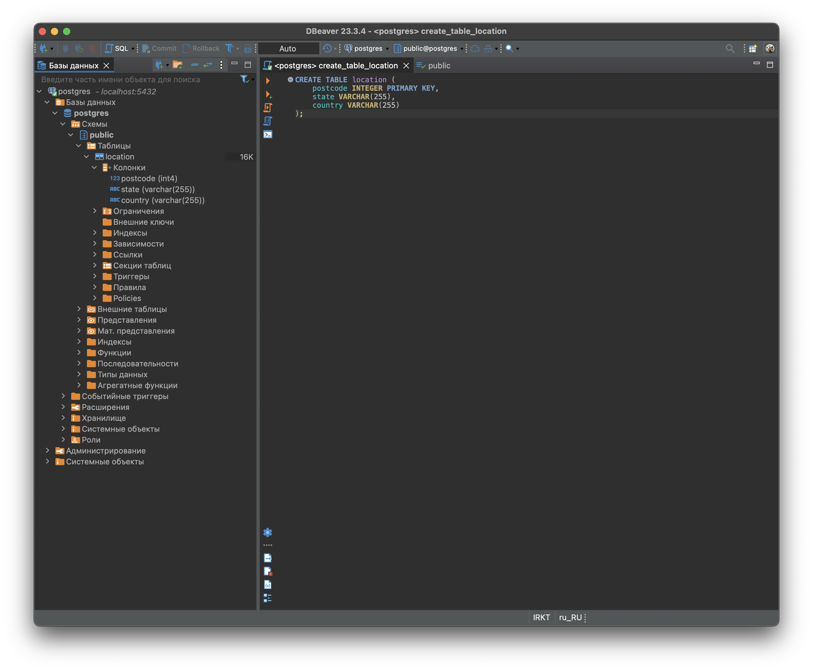
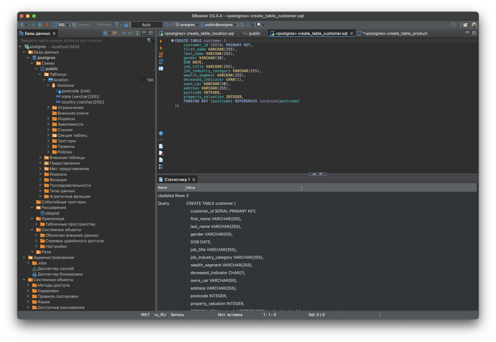
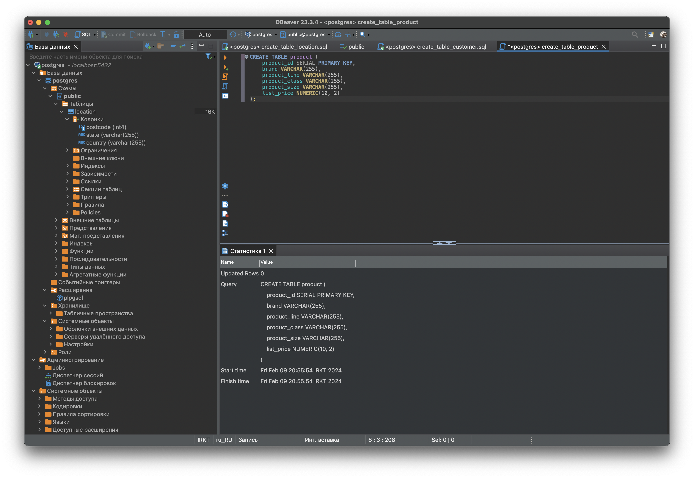
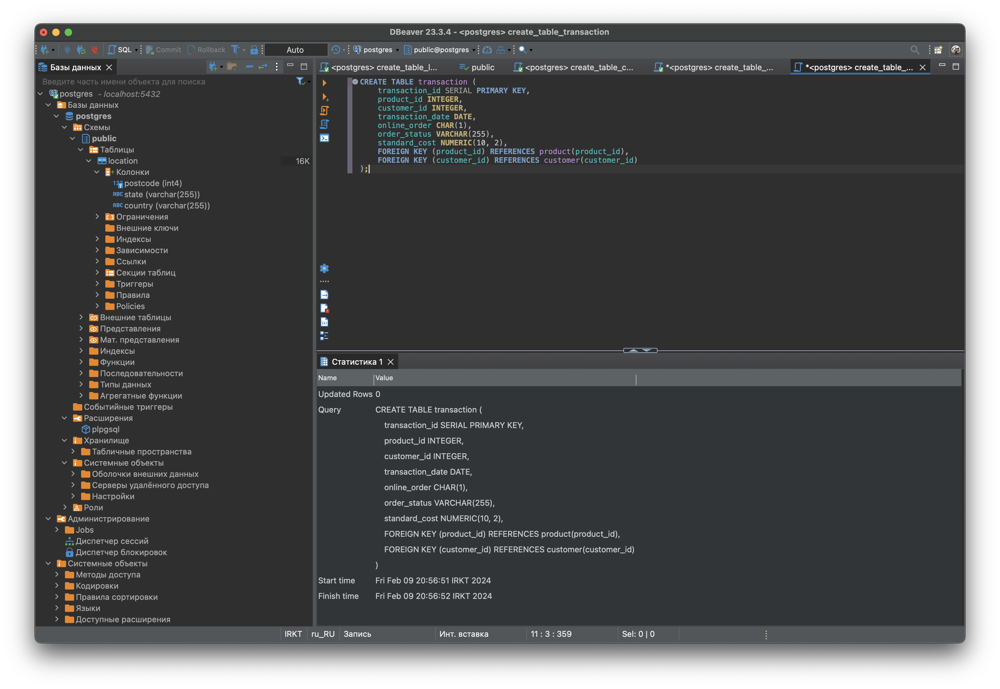
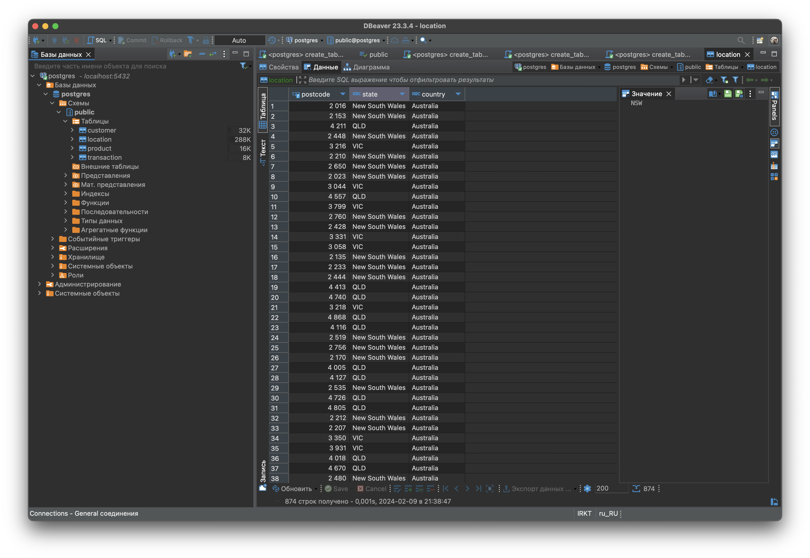
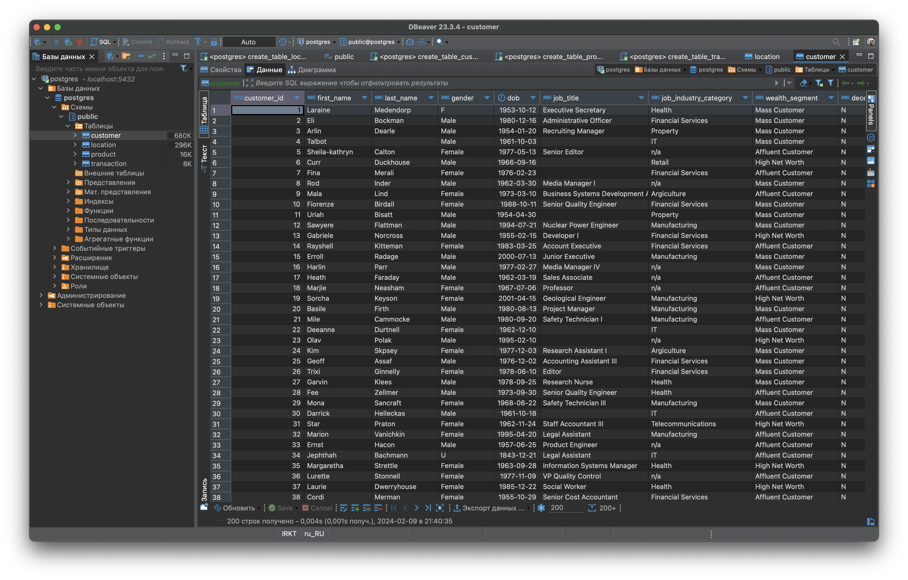
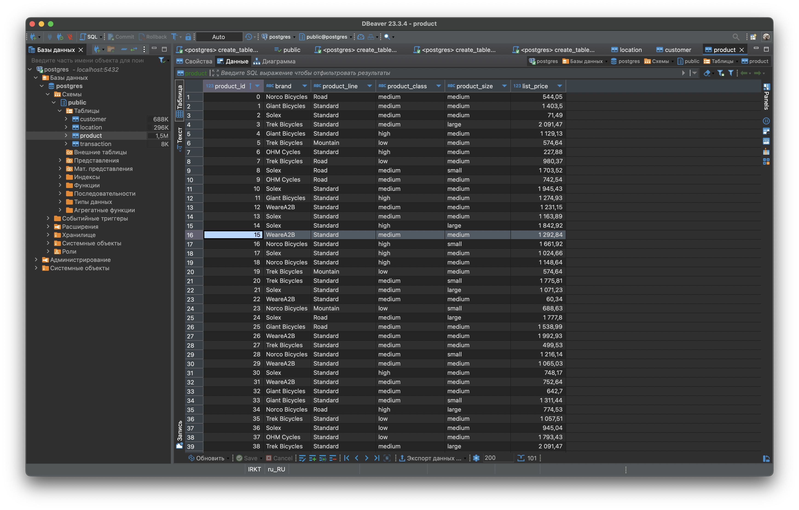
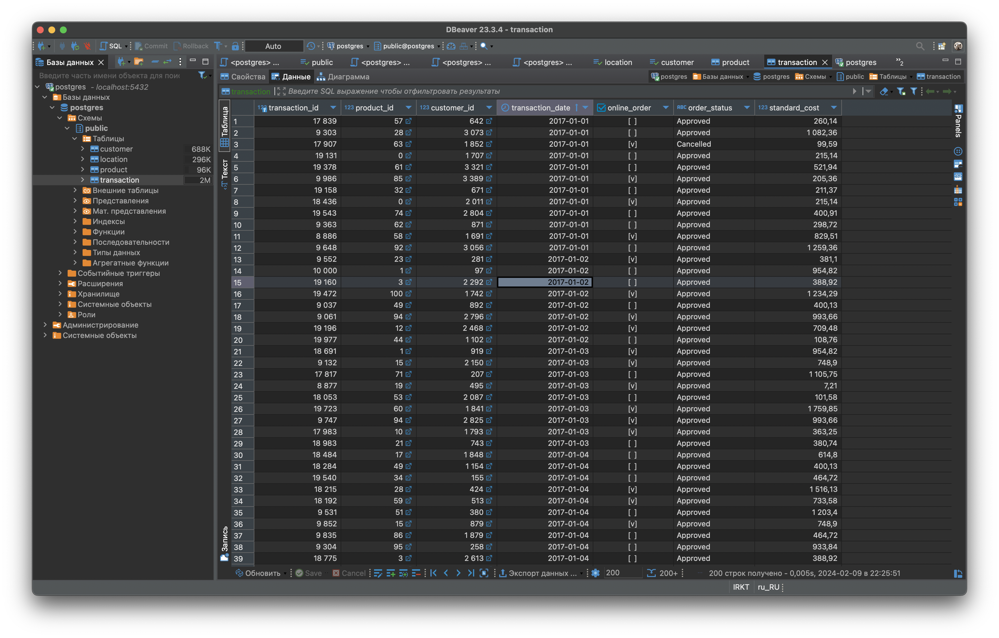

# Создание и нормализация базы данных

**Тема домашней работы** - создание и нормализация базы данных.

**Цель домашней работы** - научиться создавать базы данных и нормализовать их.

## Нормализация базы данных

Полученная база данных после нормализации:

Полученная структура базы данных, нормализованная до третьей нормальной формы (3НФ), включает в себя четыре таблицы: `customer`, `location`, `product`, и `transaction`. 

Таблица `customer`

Содержит информацию о клиентах, каждый из которых идентифицируется уникальным `customer_id`. Структура таблицы разработана для хранения основной информации о клиенте, включая его имя, пол, дату рождения, профессию и другие персональные данные. Использование postcode в качестве внешнего ключа уменьшает избыточность, ссылаясь на таблицу `location`, где хранится информация о географическом расположении.

Таблица `location`

Включает в себя уникальные почтовые индексы `postcode` как первичный ключ и предоставляет информацию о соответствующем государстве `state` и стране `country`. Это позволяет избежать дублирования географической информации в таблице `customer`, при том что у нас всего одна страна в базе данных.

Таблица `product`

Содержит детали о продуктах, включая идентификатор продукта (`product_id`), марку (`brand`), линейку (`product_line`), класс (`product_class`), размер (`product_size`) и цену (`list_price`). Каждый продукт уникально идентифицируется по `product_id`, что позволяет четко разграничивать продукты в базе данных.

Таблица `transaction`

Фиксирует транзакции, произведенные клиентами, с полями, отражающими идентификатор транзакции (`transaction_id`), идентификатор продукта (`product_id`), идентификатор клиента (`customer_id`), дату транзакции (`transaction_date`), информацию о заказе онлайн (`online_order`), статус заказа (`order_status`) и стандартную стоимость (`standard_cost`). Связи между product_id и customer_id обеспечивают связь между транзакцией, клиентом и продуктом.

Нормализация до 3НФ:

- 1НФ достигнута, так как все поля атомарны и каждая колонка содержит значения одного типа.
- 2НФ достигнута, поскольку каждый атрибут зависит от первичного ключа, исключая частичные зависимости.
- 3НФ достигнута благодаря тому, что не существует транзитивных зависимостей между атрибутами, не являющимися ключами. К примеру, вся информация о местоположении вынесена в отдельную таблицу `location`, устраняя транзитивную зависимость между информацией о клиенте и его географическим расположением, что сокращает избыточность и упрощает обновление географических данных.

Таким образом, структура базы данных оптимизирована для эффективного хранения и обработки данных, с минимальным дублированием информации и высокой гибкостью для масштабирования.

На мой взгляд изначальная таблица не соответствовала третьей нормальной форме (3НФ) по нескольким причинам, связанным с общими принципами проектирования и развития баз данных:

- Избыточность данных: В первоначальной структуре информация о местоположении (например, state, country) повторялась в каждой записи клиента, что приводило к избыточности данных. Это не только занимало дополнительное пространство в базе данных, но и могло привести к аномалиям при обновлении, удалении или вставке данных.
- Отсутствие разделения: Данные, которые логически относятся к разным сущностям (например, информация о клиенте и информация о его местоположении или информация о продукте и опреациях над ними), не были разделены на отдельные таблицы. Это усложняло масштабирование и обновление базы данных, а также могло привести к ненужному дублированию информации.
- Транзитивные зависимости: В первоначальной структуре могли присутствовать транзитивные зависимости, когда неключевые атрибуты (например, country) зависели от других неключевых атрибутов (например, postcode), а не напрямую от первичного ключа. Это нарушало требования 3НФ, согласно которым все атрибуты должны зависеть только от первичного ключа.

## Создание таблиц

В папке `scripts` находятся скрипты создания таблиц. Ниже добавлены скриншоты создания в DBeaver

Создание таблицы `location`

Создание таблицы `customer`

Создание таблицы `product`

Создание таблицы `transaction`

## Импорт данных из таблицы

Ниже добавлены строки подтверждения добавления импорта данных в таблицы.
Данные были добавлены с помощью интерфейса DBeaver

Добавление данных в таблицу `location`

Добавление данных в таблицу`customer`

Добавление данных в таблицу `product`

Добавление данных в таблицу `transaction`

## Инструменты
`DBeaver`, `Git`