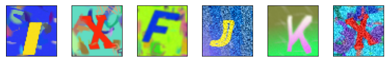
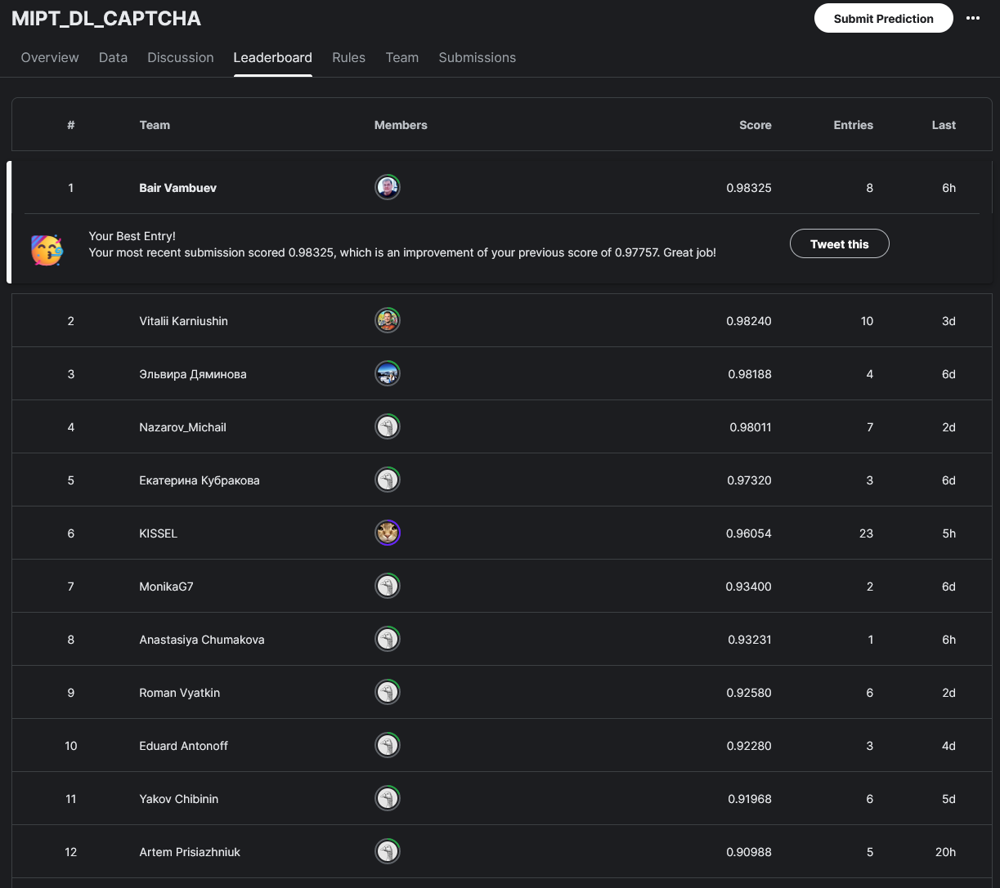

# Распознавание букв английского алфавита в виде CAPTCHA

В этом соревновании вам предлагается задача из области компьютерного зрения – распознавание букв английского алфавита на искаженных и зашумленных изображениях. Примеры:

**Описание задачи**

В этом соревновании вам предлагается задача из области компьютерного зрения – распознавание букв английского алфавита на искаженных и зашумленных изображениях. Примеры:

Данные для обучения содержатся в двух файлах: images.npy и labels.npy. Это формат numpy-массивов.

Ваша задача — обучить нейронную сеть и с ее помощью предсказать метки классов для изображений из файла `images_sub.npy`, в нем 50 тысяч изображений. Посмотрите на структуру файла `sample_submission.csv` — он не содержит полезных данных, а лишь описывает формат, в котором вы загружаете ваши предсказания на сайт. Создайте из ваших предсказаний такой же файл и загрузите в качестве вашего ответа (сабмита). Вы можете делать до 20 сабмитов в сутки.
Метрика лидерборда — accuracy, то есть доля правильно распознанных изображений.

Задача будет считаться решенной, если в Public Leaderboard вы наберете score, который будет равен или больше 0.82.

**Описание данных**

Всего доступно 20 тысяч размеченных изображений размером 48x48 с 3 цветовыми каналами (RGB), поэтому массив images имеет размер (20000, 48, 48, 3). В массиве `labels` содержатся ответы к тренировочному набору изображений. В английском алфавите 26 букв: 0-й класс соответствует букве А и так далее по алфавиту, 25-й класс — буква Z.

- images.npy - изображения для обучения
- labels.npy - метки для обучения
- sample_submission.csv - формат файла для сабмита
- images_sub.npy - изображения для сабмита

Файлы .npy - это сохраненные numpy-массивы. Их можно загрузить с помощью функции np.load(filename)

Скрин с соревнований kaggle на 01.05.2024

## Инструменты
`Git`, `Jupyter`, `numpy`, `matplotlib`, `Scikit-Learn`, `Torch`